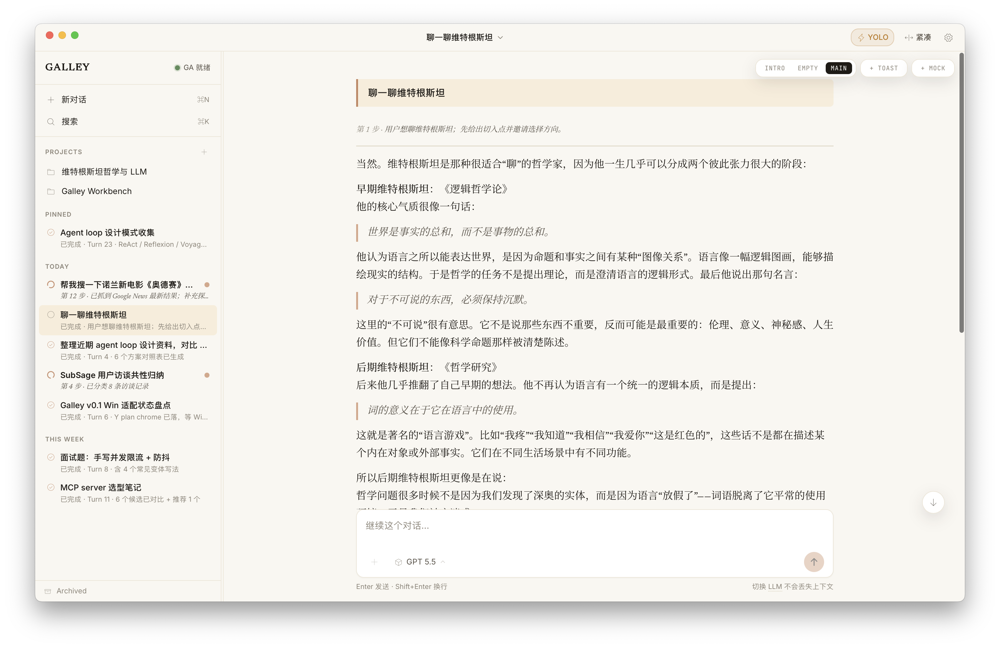
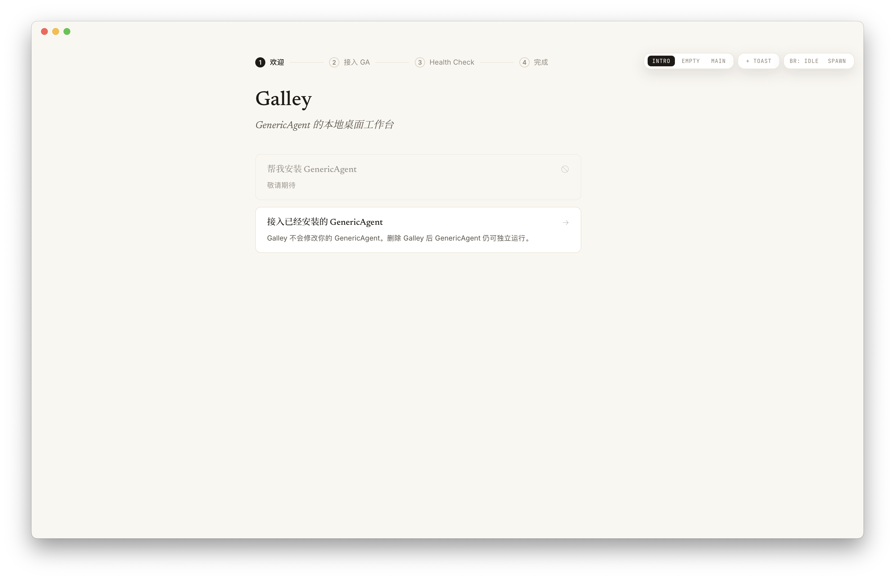
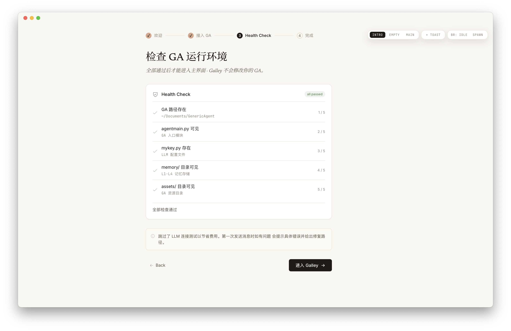
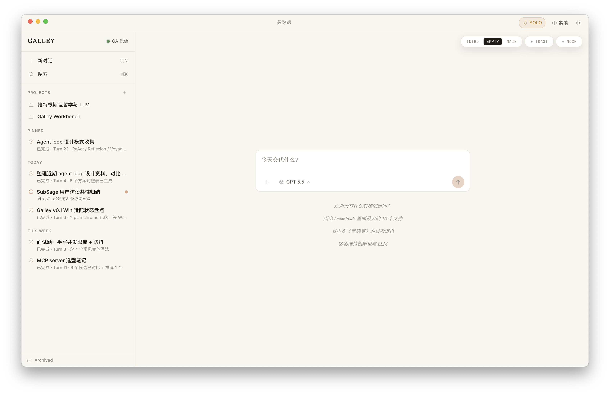
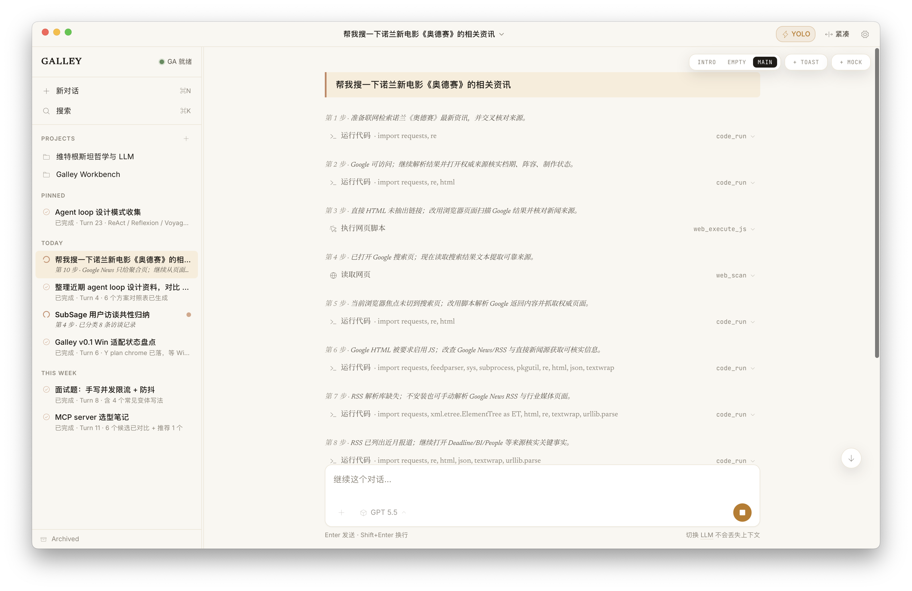

<p align="center">
  
</p>

<h1 align="center">Galley</h1>

<p align="center">
  <strong>把多个 AI Agent 当成一支团队，在自己的电脑上编排</strong>
  <br/>
  人用 GUI 推进与审批，Supervisor Agent 用 CLI 调度，共享同一份 session 与历史
</p>

<p align="center">
  
  
  
  
  
</p>

<p align="center">
  <a href="https://github.com/wangjc683/galley/releases"><strong>Download</strong></a>
  ·
  <a href="#quick-start">Quick Start</a>
  ·
  <a href="./docs/README.md">Docs</a>
  ·
  <a href="./README_en.md">English</a>
</p>

<p align="center">
  <a href="LICENSE"></a>
  <a href="https://github.com/wangjc683/galley/releases"></a>
  <a href="https://github.com/wangjc683/galley/releases"></a>
  <a href="https://github.com/wangjc683/galley/stargazers"></a>
</p>

<p align="center">
  
</p>

---

## 目录

- [Galley 是什么](#galley-是什么)
- [Highlights](#highlights)
- [Quick Start](#quick-start)
- [Supervisor / Channels](#supervisor--channels)
- [Architecture](#architecture)
- [Under the Hood（工程笔记）](#under-the-hood工程笔记)
- [Why "Galley"?](#why-galley)
- [Screenshots](#screenshots)
- [贡献 / 从源码构建](#贡献--从源码构建)
- [致谢](#致谢)

---

## Galley 是什么

Galley 让多个 AI agent session 在你自己的电脑上并行运行，随时切换、接管、继续。你在 GUI 里看进度、发指令、做审批；Supervisor Agent 在 CLI 里编排同一支 session 团队——两个角色，一份状态。

| 给人用 | 给 agent 用 | 默认开箱即用 |
|---|---|---|
| GUI 管理 session、项目、工具时间线与审批 | `galley` CLI 是稳定的公开契约，供 Supervisor Agent 调度 | 内置 GenericAgent runtime、CPython 3.11、运行依赖与浏览器控制插件 |

已有 [GenericAgent](https://github.com/lsdefine/GenericAgent) 的用户，也可以在 **Settings → Runtime** 接入外部 GA。接入后 Galley 严格只读，不改动外部 GA 的代码、memory、SOP 或 `mykey.py`。

---

## Highlights

| | |
|---|---|
| 📦 **开箱即用**<br/>下载即用。内置 GenericAgent runtime、CPython 3.11 与全部运行依赖，不必自己配 Python 环境。 | 🧭 **项目工作区 + 多会话**<br/>把一个文件夹设为项目工作区——代码仓库或资料夹都行；多条会话围绕同一个项目并行推进，再统一汇总。 |
| 🎯 **Galley Goal**<br/>交给 Galley 一个长期目标，定好时长与 Subagent 预算，它便在后台持续推进，直到达成或预算用尽。 | ⚙️ **GUI + CLI 双原生**<br/>你在 GUI 操作，Supervisor Agent 走稳定的 `galley` CLI；两端共享同一份 session 与历史，不是各开各的。 |
| 💬 **IM Channels**<br/>接入微信 / 飞书，用日常的聊天软件继续对话，也能远程调度桌面端的 Galley。 | 🔧 **工具时间线 + 审批**<br/>每次工具调用的参数、结果、耗时都内联可见；高风险动作支持逐次审批、加白名单或 YOLO 放行。 |
| 🌐 **浏览器控制**<br/>连上 Chrome / Edge / Chromium，agent 就能操作你已登录的浏览器，剩下的交给想象力。 | 💾 **持久化 + 搜索 + 后台常驻**<br/>关窗不退出，离开也能远程调度；回来随时接着聊，历史会话全文可搜。 |

---

## Quick Start

先准备一个可用的 LLM 服务：API Key、Base URL 和模型名。

| 1. 下载 Galley | 2. 配置模型 | 3. 开始使用 |
|---|---|---|
| 从 [Releases](https://github.com/wangjc683/galley/releases) 下载 macOS / Windows 安装包。 | 首次启动填入 API Key、Base URL 和模型名。 | 点击「测试并开始使用 Galley」，进入主对话界面。 |

| 平台 | 安装包 |
|---|---|
| macOS Apple Silicon | 文件名包含 `macOS_aarch64.dmg` |
| macOS Intel | 文件名包含 `macOS_x64.dmg` |
| Windows x64 | 文件名包含 `Windows_x64-setup.exe` |

<details>
<summary>安装提示</summary>

macOS 暂未代码签名，首次打开若被系统拦截，运行：

```bash
xattr -dr com.apple.quarantine /Applications/Galley.app
```

Windows SmartScreen 提示「发布者未知」时，点「更多信息」→「仍要运行」。

已有 GenericAgent 环境，可在 **Settings → Runtime → 接入外部 GA** 选择 GA 目录。

</details>

---

## Supervisor / Channels

GUI 启动后进 **Settings → Agent**：

| 按钮 | 做什么 |
|---|---|
| **复制 SOP** | 复制短版 [`galley-supervisor-sop.md`](./docs/integrations/galley-supervisor-sop.md) 发给你的 Agent，让它学会检查、继续、新开、拆分和等待 Galley 任务；高级细节见 [Supervisor reference](./docs/integrations/galley-supervisor-reference.md) |
| **查看 Agent API 文档** | 打开完整命令清单、JSON schema 和 exit code |

你不用学 CLI——用自然语言告诉 Supervisor Agent 想做什么，由它来安排 Galley。复制给 Agent 的 SOP 是轻量热路径，高级命令和编排细节留在 reference 与 Agent API 里。

任务的大小对应不同的承载方式，而不是堆成一个巨型 prompt：

- **简单问题**——直接读或跟进某个 session；
- **项目 / 资料夹任务**——用 Project Workspace 绑定工作区，多会话并行；
- **长期目标**——用 Goal 先定时长与 Subagent 预算，再交给后台持续推进。

也可以在 **Settings → Channels** 接入微信 / 飞书，用聊天软件远程给 Galley 派活、调度桌面端。

<details>
<summary>展开 CLI 示例</summary>

Galley 运行时，Supervisor Agent 可以在同一台机器上调用 `galley` 派任务：

```bash
# 看现在跑啥
galley status
galley sessions list

# 开个新 session 跟进 PR
galley session new --project=proj_work \
  --supervisor=ga-claude-1 --reason="跟进 PR review" \
  "看下 #1234 的反馈"

# 复杂目标：用一个 Project 承载一组 sessions
galley project create "Release readiness review" \
  --supervisor=ga-claude-1 --reason="并行检查发布风险"

galley session new "只读检查 app identity、数据目录、SQLite migration 和备份风险。输出风险清单和证据。" \
  --project=proj_from_create --supervisor=ga-claude-1 --reason="检查数据安全"

galley session new "只读检查 packaging、release workflow、bundled resources 和版本号。输出 release blocker checklist。" \
  --project=proj_from_create --supervisor=ga-claude-1 --reason="检查发布打包"

galley project follow proj_from_create --tail=80 --until-idle --final-show

# 长目标：先 proposal，等用户明确确认后再启动 Goal controller
galley goal propose "发布下一个 patch 版本" \
  --supervisor=ga-claude-1 --reason="准备 Goal 计划等待用户确认"

galley goal run --proposal=<proposal-id> \
  --confirm-token=<internalConfirmToken> \
  --supervisor=ga-claude-1 --reason="用户已确认启动 Goal"

galley goal status <goal-id>
galley goal deliverable get <goal-id>

# 长连接看一个 session 的事件流
galley session watch <id>

# 切 LLM / 归档 / 重启
galley llm set <id> "另一个模型名"
galley session archive <id> --supervisor=ga-claude-1 --reason="done"
```

每条命令都自动携带 origin 三元组（`via=supervisor`、`supervisor=ga-claude-1`、`reason=...`），GUI 时间线上会标注「@ga-claude-1 · 跟进 PR review · 2 分钟前」，让 human 一眼看清 supervisor 做过什么。

完整命令清单 + JSON schema + exit code 见 [`docs/agent-api.md`](./docs/agent-api.md)。

</details>

---

## Architecture

GUI 和 CLI 都接到同一个 Rust Core；Core 负责 session 生命周期、SQLite 写入和 runner 事件广播。

```text
+----------------+                  +----------------+
|   Galley GUI   |---+          +---|   Galley CLI   |
|  Tauri/React   |   |          |   |      Rust      |
+----------------+   |          |   +----------------+
                     v          v
              +------------------------+        localhost only
              |      Galley Core       | <----  unix socket / named pipe
              |          Rust          |        0600 / no token / no TLS
              |  - session lifecycle   |
              |  - projects + goals    |
              |  - SQLite authority    |
              |  - runner + events     |
              +-----------+------------+
                          |
             +------------+------------+
             v                         v
       +------------+             +------------+
       | Runner #1  |     ...     | Runner #N  |        one per session
       |  Python    |             |  Python    |
       +-----+------+             +------+-----+
             |                           |
             +------------+--------------+
                          v
              +------------------------+
              |   Galley-managed GA    |
              | - GenericAgent kernel  |
              | - Galley prompt profile|
              | - bundled CPython 3.11 |
              | - bundled dependencies |
              +------------------------+
```

- GUI 与 CLI 是**对等前端**——不是 GUI 包着 CLI，而是两端平行、各自直连 Core；
- **Rust Core 是权威层**——session / Project / Goal 状态、SQLite 写入、runner 生命周期都归它管；
- 默认走 **Galley-managed GA**——GenericAgent 作为内置 agent 内核，开箱即用。

**技术栈：** Tauri v2 + React 19 + TypeScript 5.8 + Tailwind v4 / Rust（Galley Core + Galley CLI）/ Python（runner，包装 GenericAgent）/ SQLite + FTS5 trigram

更多文档入口：
[架构说明](./docs/architecture.md) ·
[贡献指南](./CONTRIBUTING.md) ·
[文档索引](./docs/README.md)

---

## Under the Hood（工程笔记）

一些不在功能列表里、却决定了 Galley 工程质量的设计选择：

- **对等前端，不是 GUI 套壳 CLI。** GUI 和 CLI 各自直连 Rust Core，互不依赖。任何一端退出，session 与数据都不受影响；新前端（IM channel、未来的 Web）只要接同一套 Core 协议即可，不必重写编排逻辑。

- **Rust Core 是唯一权威。** session / Project / Goal 的状态机、SQLite 写入、runner 生命周期全部收敛到 Core 一处。前端只读投影、发意图，不持有可写状态，从根上避免了多端状态漂移。

- **本地优先的安全模型。** 进程间走 Unix socket / named pipe，`0600` 权限、仅 localhost、no token、no TLS——因为信任边界就是「同一台机器的同一个用户」。不把本地工具硬塞进一套网络鉴权，是有意识的减法。

- **Agent API 是冻结的公开契约。** CLI 输出带 `schemaVersion`，在 0.2.x 内冻结；每条命令自动携带 origin 三元组（`via` / `supervisor` / `reason`），GUI 时间线据此还原「谁、为什么、什么时候」动了某个 session。Supervisor 可以放心把它当 API 来编程。

- **双 runtime 的边界纪律。** 默认用 bundled GA（含 CPython 3.11 与依赖，开箱即用）；接入外部 GenericAgent 时，Galley 严格只读——不改外部 GA 的代码、memory、SOP 或 `mykey.py`，你的现有环境不会被污染。

- **可演进的持久层。** SQLite 作权威存储，有序 migration 保证升级可重放；历史会话用 FTS5 trigram 索引，中文也能子串搜索，关窗后台常驻、回来即搜。

---

## Why "Galley"?

船上的 galley 是厨房，也是工作台。每个人来这里都有自己的事，**但桌子是同一张**。

Galley 也是这张桌子：human 在 GUI 推进工作，Supervisor Agent 通过 CLI 管理 agent team。两边共享同一份 session、历史和决策日志，不是各开各的 tab。

> *Galley started as a workbench for [GenericAgent](https://github.com/lsdefine/GenericAgent). The first two letters of our name are a quiet bow to where we came from.*

## Screenshots

| | |
|---|---|
|  |  |
|  |  |

<sub>*部分截图来自早期版本，界面仍在快速迭代。*</sub>

## 贡献 / 从源码构建

```bash
git clone https://github.com/wangjc683/galley
cd galley

# Python runner（测试）
python3 -m venv .venv
.venv/bin/pip install -e ".[dev]"
.venv/bin/python -m pytest          # unit tests
GA_PATH=/path/to/GenericAgent BRIDGE_PYTHON=/path/to/python .venv/bin/python -m pytest -m e2e

# 桌面应用（开发 / 构建）
cd gui
pnpm install
pnpm tauri dev                       # macOS / Windows 桌面开发模式
pnpm tauri build                     # 出 .app / .dmg / .exe

# Galley CLI（独立构建）
cd ../core
cargo build --release -p galley-cli  # 出 target/release/galley
```

CI release 流程见 [docs/release-update-sop.md](./docs/release-update-sop.md)（[背景与故障排查](./docs/release-workflow.md)）；手动 Windows build 见 [docs/windows-build-checklist.md](./docs/windows-build-checklist.md)。

## 致谢

[**lsdefine/GenericAgent**](https://github.com/lsdefine/GenericAgent) 是 Galley 当前的 agent 内核。Galley 的内置 runtime 基于 GenericAgent，并保留外部 GA attach 兼容路径；在此之上，Galley 提供本地编排、GUI / CLI 对等前端、session 持久化、审批、搜索和打包后的开箱即用体验。

相关论文：[GenericAgent: A Token-Efficient Self-Evolving LLM Agent via Contextual Information Density Maximization (arXiv:2604.17091)](https://arxiv.org/abs/2604.17091)

## License

[MIT](./LICENSE)
